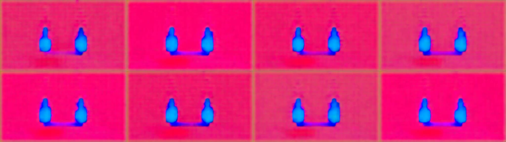

# VACE 隔离兼容性实验

此目录不进入七个 Skill 的发行包，不改变 AVIR 的时间或摄影机权威。包含原版 CUDA 路径的帧选择／像素预处理检查，以及独立 ComfyUI／MPS 的真实推理实验；**前者发现时间与画幅不兼容，后者已实际执行但画面质量 FAIL**。产品控制注册表的通用 VACE 适配仍未集成。

原版预处理固定官方仓库 [ali-vilab/VACE](https://github.com/ali-vilab/VACE/tree/48eb44f1c4be87cc65a98bff985a26976841e9f3)，提交、相关源码 SHA-256、Wan 1.3B 参数在 `upstream-lock.json`。该运行器未加载原版权重；不能将另一运行器的权重验证计入它。ComfyUI 路线单独固定在 `comfy-runtime-lock.json`，三份实际权重均已下载并校验。

## ComfyUI 实际推理结果

见 [复跑说明](COMFY-EXPERIMENT.md)、[实际提交工作流](comfy-cafe-workflow.json) 和 [实收证据](comfy-cafe-evidence.json)。固定 AVIR 的 S1 在 Blender 重渲染为 512×288、16 fps；65 帧控制包含 4000 ms 结束边界。真实本地作业成功返回 65 帧 WebM，耗时 1033.494 秒、商业 API 费用为 0；按事前规则移除结束边界帧，得到 64 帧、4 秒 MP4，原始文件同时保留。

实际查看抽帧后，画面为洋红背景和蓝色人形轮廓，没有符合人物／服装／手部动作／光色要求。**执行成功，质量 FAIL，轨迹误差不可确定，未证明控制收益。** 单帧读取与 VAE 编解码对照保持中性灰，仅排除该单帧路径的明显颜色异常；不能据此排除视频解码或生成器问题。后续无白模对照、相同采样结果的标准解码，以及单帧 FP16／FP32 对照均已实际完成，仍未恢复合格画面，见[诊断记录](diagnostics-r1/README.md)。



## 实际结果

| 输入 | 原版预处理及固定 16 fps 保存 | 结论 |
|---|---|---|
| 本地 Blender cafe 白模，640×360、24 fps、96 帧、4 秒 | 640×352、93 帧、5.8125 秒，最大帧时间偏差约 1791.667 ms | BLOCKED：时长、事件映射和画幅发生变化 |
| 独立合成正例，832×480、16 fps、81 帧 | 832×480、81 帧，逐帧时间偏差为 0 | PREPROCESSING_ONLY：本例预处理可兼容；非生成质量通过 |

完整逐帧映射和实收探测在 `evidence.json`。正例的实际 MP4 stream duration 为 5.062012 秒，输入输出一致；81/16 是名义帧时长，未用它覆盖容器实际探测值。预处理预览是对输入像素的确定性转换，不是 VACE 生成视频。两个目录的原始输入及预览留在本地 `outputs/vace-investigation/`。

`inspect_preprocessing.py` 加载未修改的官方 `VaceVideoProcessor`，调用 `_get_frameid_bbox` 与 `_video_preprocess`。解码与时间戳分别来自 FFmpeg/FFprobe，**没有运行官方 decord 读取器**，因此不能将这个函数级结果扩展为完整官方 loader 或推理实测。重采样帧号、裁切尺寸、实际输出时长均保留。

官方 Wan 路径 `wan_vace.py` 显式使用 CUDA；本机实际宿主探测为 Apple arm64、CUDA 不可用、MPS 可用。实验 CPU 环境下 MPS 探测受沙箱影响，另存宿主探测以避免误判。官方 CUDA 路径不能直接在本机执行，但这不代表所有 VACE 实现均不支持本机；[ComfyUI 官方 VACE 路线](https://docs.comfy.org/tutorials/video/wan/vace) 需独立核验，不能继承本实验结论。

## 复跑

原版预处理需要已有 Python 环境含 numpy、torch、torchvision、Pillow，以及 ffmpeg/ffprobe。使用隔离环境，不向现有 ComfyUI 环境安装依赖。该预处理阶段只读取已有 PyTorch 运行时；后续 ComfyUI 实验的模型目录与服务隔离方法另见上文。

```bash
git clone https://github.com/ali-vilab/VACE.git outputs/vace-investigation/upstream
git -C outputs/vace-investigation/upstream checkout 48eb44f1c4be87cc65a98bff985a26976841e9f3

python experiments/vace/inspect_preprocessing.py \
  --upstream outputs/vace-investigation/upstream \
  --media /absolute/path/to/clay.mp4 \
  --out outputs/vace-investigation/new-preprocessing-run

ffmpeg -f lavfi -i testsrc2=size=832x480:rate=16 -frames:v 81 \
  -c:v libx264 -pix_fmt yuv420p outputs/vace-investigation/compatible-control.mp4
```

脚本拒绝源码摘要/提交不匹配、覆盖已有输出目录。实际检查了错误 checkout 和已有输出目录的拒绝路径。命令退出 0 表示实验报告成功写出，**是否可直接保留制作计划必须读取报告 status/reasons**，不把实验执行成功等同模型输入就绪。

## 接续验收门

1. 从冻结 AVIR 重新设计兼容的时基、帧数和画幅，或由上游明确批准时间/裁切映射；不能将 4 秒任务静默改成 5.8125 秒。
2. 固定实际运行器及权重 revision、预处理器、条件编码；记录遮罩白色为生成区域、黑色为保留区域，与参考图职责分离，依据[固定版本官方指南](https://github.com/ali-vilab/VACE/blob/48eb44f1c4be87cc65a98bff985a26976841e9f3/UserGuide.md)。本实验未验证遮罩或深度/姿态编码。
3. 在兼容硬件/运行器上执行冻结镜头，保留原始控制输入、实际模型输出、耗时、费用和失败；进行身份、动作、轨迹、光色观察后，才判断质量。

以上三项是原版运行器的后续门槛；ComfyUI 的实际权重、推理耗时与质量失败独立记录，不覆盖原版预处理结果，也不把低分辨率实验当作完整方案交付。
