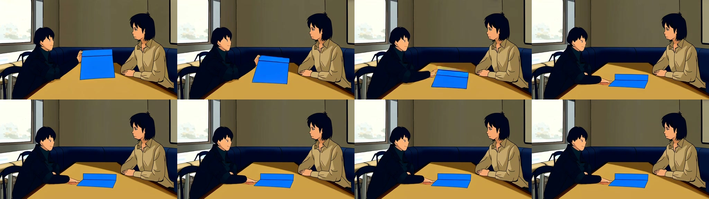

# VACE CPU 四秒基线

同一独立 CPU / FP32 VAE 服务完成 65 帧真实生成，耗时 **2902.964 秒（约 48 分 23 秒）**。模型采样节点未命中缓存；完整的源版本、缓存节点、实际文件摘要和限制见 [evidence.json](evidence.json)。商业 API 费用为零。

[查看实际四秒视频](actual-output.mp4)

实际查看全部 64 个交付帧的顺序拼图，并在 Chrome 启动播放、确认到达 4.000 秒结束。可辨认左侧深蓝服装人物、右侧米色服装人物、左窗和桌面；蓝色折纸在前段下降，后段停在桌上。但整体仍为明显卡通，脸和手部简化，道具仍像折起的纸板，未恢复原定自然摄影质感。**质量 FAIL**；没有将人物可辨认等同于身份一致性通过，也没有填入未测量的轨迹误差或接触事件时间。

该基线没有输入控制视频。相较之前 MPS 视频，画面可辨认程度提高，但运行设备、模型计算精度与 VAE 精度同时变化，不能据此确定根因；与 CPU 单帧相比，帧数改变了噪声张量形状，也不是逐元素相同噪声。单个种子与单个工作流的失败不证明所有 VACE 设置失败，亦不构成控制收益证据。

提交前冻结的 [工作流](workflow-api.json) 和 [实验合同](frozen-experiment.json) 原样保留。原始 65 帧 WebM 在本地保留，大小 145431 字节，SHA-256 为 `140450d1cbf1026b60233c2255fe46933515f7049586519d8471c7fe01306bab`。公开 MP4 是重编码副本：按事前规则保留第 0–63 帧，以原始名义 16 fps 输出，只移除第 64 个结束保护帧，无空间裁切；不是模型原生 MP4。原始 Matroska 的毫秒时间基有量化，交付 MP4 使用精确 16 fps 时基，实测 64 帧、4000 ms、512×288，无音轨。

本地完整记录位于 `outputs/vace-investigation/comfy-cpu-video-r1/`，包含原 WebM、完整回执和八张覆盖全部帧的顺序拼图。冻结文件中的相对来源路径属于这个原始本地目录布局。源码和权重来自 [运行时锁](../comfy-runtime-lock.json)，没有修改原 ComfyUI 源码、依赖或用户数据库；作业完成且队列为空后，已停止本任务创建的 CPU 服务和临时播放服务器。

复跑使用 [独立服务说明](../COMFY-EXPERIMENT.md)，添加 `--cpu --fp32-vae`，使用新的独立 base/input/output/database 目录及空闲端口；然后提交本目录原始工作流。一次运行可能占用约 48 分钟，实际时长取决于设备。记录新作业编号并只查询该编号，不因查询超时重复提交。本记录不授权商业接口支出，也没有把实验后端登记为通用生产适配器。
