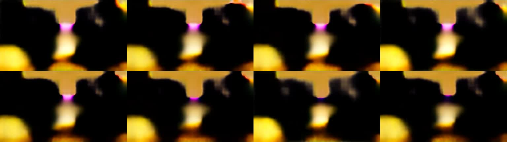
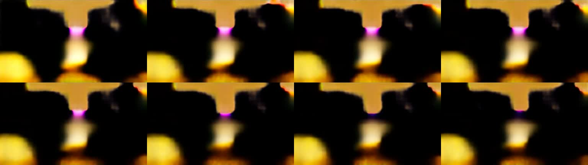
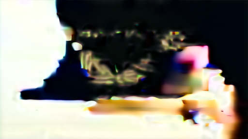
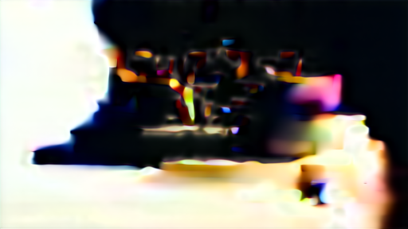

# VACE 实际失败诊断

这三组实验接续 `../comfy-cafe-evidence.json` 中的失败，不改变其事前验收标准。使用同一个固定 ComfyUI 服务、三份已校验权重和独立目录；未修改运行器、安装自定义节点或调用付费 API。完整摘要见 [evidence.json](evidence.json)。

| 对照 | 实际耗时 | 观察和结论 |
|---|---:|---|
| 去掉 `control_video`，其余提示、种子、权重、65 帧与采样参数相同 | 1015.477 秒 | 黑色轮廓、黄色背景、局部洋红色；人物、手部和信封不可可靠识别，FAIL |
| 对上一组的同一采样结果使用标准 VAE 解码 | 80.481 秒 | 实际回执确认 KSampler 节点 10 缓存命中；八张抽帧仍失真，分块解码不是充分解释 |
| 同提示／种子／checkpoint 的单帧 FP16 与 FP32 计算精度 | 两支合计 59.336 秒 | 两张原始 PNG 均为严重色块，未观察到 FP32 恢复；单帧不检验时序或完整动作 |

前两组原始 WebM 均经实际解码探测：512×288、65 帧、16 fps、容器时长 4063 ms。无控制组按原先冻结规则保留帧 0–63，得到 64 帧、4000 ms MP4，原始视频保留。本目录中的八帧图来自实际视频的 2 fps 抽帧，不能代替完整播放和逐帧动作审核。

单帧对照使用内置 `ModelComputeDtype`，只改变模型计算 dtype；仍使用原 fp16 checkpoint 和同一个 VAE／CPU 文本编码器，没有把它称为原生 FP32 权重对照。新增节点源码的提交和摘要单独保存在证据中。

`*-workflow.json` 是实际提交图；`*-frozen.json` 是提交前文件的原样副本，其中 `NOT_RUN` 是当时状态，不作事后改写。完成状态、实收和观察在 `evidence.json`。各组工作流与冻结文件均有字节 SHA-256；完整历史与原始视频保存在本地 `outputs/vace-investigation/comfy-*-r1/`，公开摘要不冒充厂商签名回执。

复跑沿用上级 [独立服务启动说明](../COMFY-EXPERIMENT.md)，提交本目录相应图到本地 `/prompt`，每次保留新的真实编号和输出，不在超时后重交。同采样解码对照须在无控制组之后、缓存仍保留时运行，并检查历史中的 `execution_cached` 包含节点 10；缓存未命中时不得声称复用了同一采样结果。

结论保持 **CAUSE_UNRESOLVED / CONTROL_BENEFIT_NOT_ESTABLISHED**。这些结果不能推出 VACE 或 MPS 普遍不兼容，也不能证明控制收益。下一项门槛是在已核验运行器上取得可辨识的生成基线，再做同一冻结镜头的时序控制对照；产品通用 VACE 适配继续未集成。

2026-09-25 补查到 ComfyUI 上游 [issue #15793](https://github.com/Comfy-Org/ComfyUI/issues/15793)：报告者在不同 Apple 芯片上观察到 Wan 输出失真，切换精度和标准／分块解码未解决其复现。其具体对照主要使用 Wan2.2 5B，与本次 VACE 1.3B、单帧也失败的条件不同；这是后续跨设备／CPU 基线诊断的线索，不是本实验的原因证明或已验证修复。未据此修改用户的 ComfyUI／PyTorch 环境。

后续 [CPU 单帧实跑](../cpu-baseline-r1/README.md) 得到了可辨识的卡通人物和桌面，但仍不符合原自然质感要求。设备和 VAE 精度同时改变，根因与控制收益仍未确定；不覆盖本目录三组原始失败结果。
