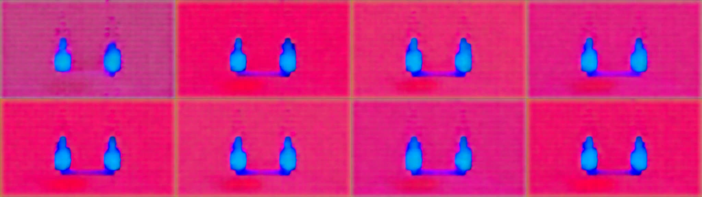

# 真实单镜头视频的观察与返修回放

原生 AVIR 是十二秒、三个镜头；实际 VACE 实验事前冻结并生成的是 S1，交付视频为四秒。旧观察工具只接受完整项目时长，因此这份真实结果无法进入 `review → repair`。本次保留同一原生包、完整评价基线、原始实验和媒体字节，以显式 `execution_range: {"start_ms": 0, "end_ms": 4000}` 关联局部实收。

[evidence.json](evidence.json) 保留旧模块／旧 schema 的实际拒绝、新工具结果及文件摘要。旧复现使用 b83f6ac 的 `media_review.py` 与 review schema，其他验包／探测依赖为当前代码，未将这种定向回放称为旧提交全套运行。

这次重新从实际 64 帧交付 MP4 提取第 0、8、16、24、32、40、48、56 帧，时间为项目 0、500、…、3500 ms，并实际查看。使用帧索引选择，不把 `fps=2` 的输出时间戳假定为输入帧的精确时间。



[observations.json](observations.json) 仅在这八个时刻记录可见的严重光色失败；没有将单帧观察扩成连续时段，也未提供无法可靠获得的身份／道具坐标或动作事件时刻。轨迹 `coverage=0`，`mean_error/max_error=null`；287 个局部计划点中，205 个缺少有效观察、82 个计划状态不可用于确定投影。完整项目仍有 931 个计划点，`complete_project_scope=false`，不能将本记录解释为全片验收。

当前 CLI 实际完成：

```bash
python video-prompt-compiler/scripts/control_cli.py review observations.json \
  --package /absolute/path/to/original-frozen-package \
  --media /absolute/path/to/exact-delivery-4s.mp4 --out /new/evaluation.json
python video-prompt-compiler/scripts/control_cli.py repair \
  /absolute/path/to/original-frozen-package /absolute/path/to/original-frozen-package \
  --artifacts /absolute/path/to/original-render/artifact-manifest.json \
  --observations observations.json --media /absolute/path/to/exact-delivery-4s.mp4 \
  --out /new/repair
```

本地完整回放位于 `outputs/vace-investigation/scoped-review-r1/`，最终结果为 `evaluation-final.json` 与 `repair-current/`。生成八个 `OPEN` 任务，内容见 [repair-tasks.json](repair-tasks.json)，责任暂归 `external-runner` 诊断实际执行失真，没有证据就不改上游照明或人物设计。媒体失败任务现在先核对冻结请求与实际执行，不再把上游设计修订列为必做动作。原白模输入用途保持 `RETAINED`，这表示没有因输出失败而废弃它，并非补签视觉审核。

仍未完成：外部运行器的质量修复、具体 V5 项目任务交接、合格视频及控制收益验证。`review` 的映射声明也不是厂商提交证明，必须与真实冻结请求和实收回执一起保留。本次新增模型调用为零。
