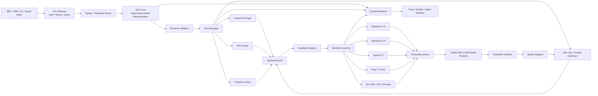
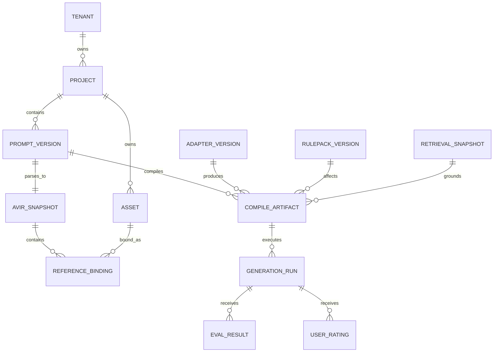
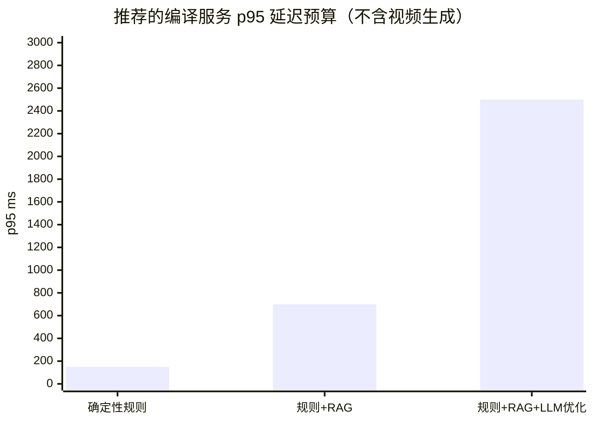

# 视频提示词编译器（SKILL）深度研究与可执行方案

## 执行摘要与关键结论

**研究快照：2026-09-19。** 本报告把“视频提示词编译器”定义为一个真正的 **Prompt Compiler**，而不是“用大模型把用户提示词润色一下”。它接收自然语言、多模态参考资产与制作约束，将输入解析为供应商无关的中间表示，再通过规则、检索、优化器和模型适配器，编译为 Seedance、Agnes、Kling、Wan、MiniMax H3、Veo、Runway 等后端可以执行的 prompt + parameters + reference bindings，并保留完整的版本、来源、解释和回滚信息。

截至当前研究快照，ByteDance 已正式推出 Seedance 2.0 与 Seedance 2.5：2.0 重点是统一的文字、图片、音频、视频多模态输入和音视频联合生成；论文公开的开放平台配置包含 4–15 秒视频及多种参考资产；2.5 将单次创作扩展到 30 秒，更强调完整叙事、参考控制与编辑。citeturn0search12turn0search20turn0search8turn0search23 Agnes Video 2.5 已有结构完整的 `/v1/videos` API，包括 `<Picture N>`、`<Audio N>`、`<Video N>` 显式引用语法、4–12 秒、720P–2K 以及参考图片、视频和音频输入。citeturn17view0 Kling 当前应默认适配 **Kling 3.0 / Kling 3.0 Omni**，而不是把“kling”固定到旧版；官方能力图已将 `kling-v3` 与 `kling-v3-omni` 列为当前 3.0 系列，并明确强调 native audio、多镜头叙事及 Omni 多模态能力。citeturn20search0turn23search0

本报告最重要的结论是：

| 决策 | 建议 |
|---|---|
| 核心抽象 | 建立供应商无关的 **AVIR（Audio-Visual Intermediate Representation）**，任何模型都不得成为内部数据模型 |
| 首批生产适配 | `seedance2.0`、`seedance2.5`、`agnes-video-2.5`、`kling-v3 / kling-v3-omni` |
| 强烈建议追加 | MiniMax H3、Wan 3.0、Veo 3.1、Runway Gen-4.5 |
| Context-IR | 借鉴 MiniMax H3 的 Context-IR 思路，但不要照搬其自然语言 IR；内部使用 typed AVIR，扩展型 Context-IR 只是一个优化 pass |
| Prompt 编译方式 | **确定性规则优先，RAG 次之，LLM 优化最后介入**；不能让 LLM 成为语义正确性的唯一保障 |
| Token 管理 | 同时保存 `canonical_count` 与 `native_count`；厂商 tokenizer 未公开时，绝不能伪造“精确 token 数” |
| 多模态参考 | 将“参考资产”和“参考资产的角色”作为一等数据，例如 `identity_ref`、`motion_ref`、`style_ref`、`audio_ref` |
| 版本策略 | 版本化的不只是代码，而是 `compiler + AVIR schema + rulepack + adapter + template + retrieval snapshot + optimizer` 整套编译清单 |
| 质量优化 | 用离线 A/B、VBench/VBench++、人工偏好和“每个可接受视频成本”闭环，而不是用 prompt 长度作为质量代理 |
| SKILL 架构 | `SKILL.md` 保持最小入口，模型细节、专家参数、优化器说明按需加载，严格采用渐进式披露 |
| Sora | **不建议投入新的 Sora 2 API 主适配工作**：OpenAI 官方已宣布该 Videos API 将于 2026-09-24 关闭。citeturn2search0 |

另一个关键发现来自 MiniMax H3。官方 H3 模型卡把完整系统拆为 **H3-Context-IR → H3-Base → H3-Regenerate-2K**：Context-IR 负责解析自由形式的文字、图像、音频、视频之间的关系，并序列化为结构化理解；官方同时明确说明 Context-IR 本身依赖托管的多阶段服务，没有完全开源。官方示例中的 Context-IR 输出已经是包含时间、镜头、动作、声音、音乐的长结构描述，一个 10 秒 T2VA 示例报告了 5,650 input tokens 和 2,915 output tokens。citeturn9view0 这给本项目一个很强的工程启示：**“上下文理解”和“最终 prompt”必须是两个层次；Context-IR 不应该等于最终 prompt。**

因此，建议内部编译链采用：

> **用户意图 → AST → AVIR-Core → AVIR-Temporal/RefGraph → 可选 RAG/Context-IR → 优化 passes → Backend Lowering → Prompt/Payload → Generation → Evaluation Feedback**

而不是：

> 用户 prompt → LLM 润色 → 厂商 API

后者很容易失去引用关系、时间约束和版本可重现性。

对于“额外主流模型”，本报告建议纳入 **Wan 3.0、MiniMax H3、Google Veo 3.1、Runway Gen-4.5**。Wan 3.0 的价值在于最长 30 秒和文档/网页等 Omni-Reference 输入，非常适合企业“已有材料→视频”场景；官方页面当前宣传最多 20 个参考资产。citeturn26search2turn26search12turn26search22 H3 是目前公开资料中最值得借鉴的 Context-IR 视频架构。citeturn9view0 Veo 3.1 有成熟开发接口，支持文本/图像、首尾帧、参考图、视频扩展和原生声音，标准生成支持 4/6/8 秒并可通过扩展机制形成更长序列。citeturn2search2turn2search12turn2search14 Runway Gen-4.5 则具有稳定的视频 API 抽象，其官方接口把 `prompt_text`、比例和 duration 明确分离，适合作为“结构化参数不要塞回 prompt”这一设计原则的参考。citeturn4view0turn5view0

**推荐最终形态不是“提示词增强器”，而是一个面向视频生成系统的中间语言、编译器、模型网关和评估系统。**

## 模型版图与后端特性映射

首要原则是：**能力矩阵必须是数据，不应写死在业务代码中。** 视频模型变化太快，同一个品牌下不同版本的 duration、参考资产、声音和编辑能力都会变化。每个 adapter 应对应一个版本化 `CapabilityProfile`，并记录来源、更新时间和置信级别。

推荐能力注册表的基础结构：

```yaml
model_id: seedance2.5
adapter_version: 1.2.0
capability_schema: video-capability/v1

modalities:
  input: [text, image, video, audio]
  output: [video, audio]
features:
  native_audio: true
  multi_reference: true
  editing: true
  multi_shot: true

limits:
  max_duration_s: 30
  max_prompt_tokens: null       # 未有可信官方 tokenizer/cap 时不要猜
  tokenizer: opaque

prompt:
  preferred_structure:
    - subject
    - scene
    - temporal_action
    - camera
    - visual_style
    - audio
    - consistency
  native_reference_syntax: null # 由渠道 adapter 决定

sources:
  - type: official
    effective_at: 2026-07-31
    url: "..."
```

当前建议维护如下模型矩阵：

| 模型 | 官方资料确认的核心能力 | 编译器应利用的优势 | 主要兼容问题 | 优先级 |
|---|---|---|---|---|
| **Seedance 2.0** | 文本/图片/音频/视频统一输入；直接音视频生成；论文描述 4–15s、480p/720p，开放平台最多可组合 3 个视频、9 张图、3 段音频。citeturn0search20turn0search12 | 多参考、声音、镜头、角色引用同时编译 | 不同接入渠道的 API payload/引用方式可能不同，不能臆造统一占位符 | P0 |
| **Seedance 2.5** | 单次创作扩到 30s，强化完整叙事、灵活引用和编辑；ByteDance/Dreamina 产品面还展示了大量 references 的工作流。citeturn0search8turn0search23turn0search5 | 长叙事、story beats、多个引用、音视频整体设计 | 产品 UI 的 reference 上限不能直接视为所有 API 渠道上限 | P0 |
| **Agnes Video 2.5** | T2V、首/尾帧、多模态 reference、V2V、A/V coordination；4–12s；720P/1080P/1K/2K；最多 8 图、1 视频、3 音频，总 reference ≤12。citeturn17view0 | API 规范清楚，适合做第一个“严格 lowerer” | 使用 `<Picture N>` / `<Audio N>` / `<Video N>`；不接受若干传统 diffusion 参数 | P0 |
| **Kling 3.0** | 当前官方能力表列出 `kling-v3`，强调原生音频、元素一致性、多镜头 storytelling。citeturn20search0turn23search0 | multi-shot、声音、角色连续性 | “Kling”不能等价于固定旧版；具体限制须从版本 profile 获取 | P0 |
| **Kling 3.0 Omni** | `kling-v3-omni` 是当前 Omni 分支，官方描述其面向多模态和跨任务整合。citeturn23search0 | 多模态 reference / edit 工作流 | 编译器必须根据输入模态决定普通 V3 还是 Omni | P0 |
| **Wan 3.0** | 最长 30s；文本、图像、音频、视频、文档、网页等输入；官网显示最多 20 个 reference assets。citeturn26search2turn26search12 | 文档到视频、品牌材料到视频、长叙事 | document/web 输入要求额外的内容抽取与可信来源管理 | P1 |
| **MiniMax H3** | 统一文字/图像/视频/音频输入、原生声音、最长 15s、最高 2K；官方系统包含 Context-IR。citeturn9view0 | 最直接的 Context-IR 技术参照；多模态引用 | 官方 Context-IR 服务没有完全开源，不能形成核心依赖 | P1 |
| **Google Veo 3.1** | T2V/I2V、首尾帧、reference images、extension、原生音频；4/6/8s 生成，支持 16:9/9:16，多种分辨率；可延长视频。citeturn2search2turn2search12turn2search14 | 企业 API、参考图、扩展、音视频 | Prompt 语言、参考图数量和长度要求需要 profile 化 | P1 |
| **Runway Gen-4.5** | 官方 API 提供当前 Gen-4.5 视频入口，prompt、ratio、duration 分为独立参数。citeturn4view0turn5view0 | 成熟 API 形态、制作型 workflow | 不要把 ratio/duration 等结构化参数重新写进文本作为唯一控制 | P1 |
| **Sora 2** | 官方 API 已进入退役阶段，关闭日期 2026-09-24。citeturn2search0 | 仅维持迁移/兼容测试 | 不值得作为新系统主线投资 | P2/退役 |

这里尤其要区分三种“模型限制”：

**硬能力（hard capability）**是 API 是否支持，例如 Agnes 的 `duration=4–12`、reference 数量等，编译阶段必须阻止非法请求。官方文档明确规定 Agnes 的 `n` 只能为 1，并且不接受 `width`、`height`、`fps`、`num_frames`、`steps` 等常见生成参数。citeturn17view0

**软能力（soft capability）**是模型是否“更擅长”某种提示结构，例如 Seedance 2.5 的长叙事、Kling 3.0 的 multi-shot、H3 的 Context-IR。这类信息应影响模板和 optimizer，但不能变成 API validator。citeturn0search23turn23search0turn9view0

**经验能力（empirical capability）**则只能由自己的 benchmark 得到，例如“同样 10 秒广告在 Kling 还是 Seedance 上身份一致性更高”。这类结论不能从营销材料硬编码，而应进入 `ModelQualityRegistry`，按模型版本、任务类型、分辨率和日期持续更新。

推荐模型自动路由逻辑：

```text
用户显式指定模型
        │
        ├── 是 → 校验硬能力 → compile
        │
        └── 否
             │
             ├── document/web input → Wan 3.0 候选权重提高
             ├── 需要 Context-IR / open workflow → H3 候选提高
             ├── 需要 30s narrative → Seedance 2.5 / Wan 3.0
             ├── multi-shot + native audio → Kling 3.0 / Seedance 2.5
             ├── first/last/reference control → Agnes / Veo
             └── 最后按 quality、cost、latency、availability 排序
```

自动路由不应该有一个永久的“最佳模型”。建议用：

\[
Utility(m)=
w_q Q(m,task)
-w_c Cost(m)
-w_l Latency(m)
+w_a Availability(m)
-\lambda \cdot Unsupported(m)
\]

其中 `Q(m,task)` 来自自己的评测，不来自模型厂商之间不可比的宣传分数。

## 业界方案、开源实现与关键技术

本次检索没有发现一个成熟开源项目可以直接完成“Seedance + Kling + Agnes + Veo + Wan 的视频 prompt typed IR → 跨供应商 lowering → 视频评测”这一整条链。现有方案更适合作为不同层的**构件**。最接近视频侧“编译前端”的公开实现是 MiniMax H3 Context-IR；最值得借鉴的 prompt compiler/optimizer 思想来自 DSPy、IBM PDL、LMQL、Guidance。

| 项目 | 仓库/主页 | 许可证 | 可借鉴的设计 | 优点 | 不足与适用场景 |
|---|---|---|---|---|---|
| **MiniMax H3** | [MiniMaxAI/H3](https://huggingface.co/MiniMaxAI/H3) | MiniMax H3 Community License | Context-IR、统一多模态 sequence、Base + Regenerate 分层 | 与本项目的视频场景最直接相关；公开展示 Context-IR 输出和 token usage | Context-IR 多阶段托管部分没有开源；适合“设计参考 + 可选 H3 adapter”，不宜成为核心依赖。citeturn9view0 |
| **DSPy** | [stanfordnlp/dspy](https://github.com/stanfordnlp/dspy) | MIT | Signature、Module、Optimizer，把 prompt 优化视为可学习程序优化 | 非常适合做离线 template/few-shot optimizer | 面向 LLM 程序，不解决视频 reference、timeline 和厂商 payload。官方定位就是“programming, not prompting”。citeturn28search0turn28search2 |
| **LMQL** | [eth-sri/lmql](https://github.com/eth-sri/lmql) | Apache-2.0 | 类型、模板、约束、优化 runtime、多后端 | 约束和 portable backend 思路适合编译器 | 其主要对象仍是语言模型 decoding；视频 API 往往是黑盒服务。citeturn28search1turn28search3 |
| **Guidance** | [guidance-ai/guidance](https://github.com/guidance-ai/guidance) | MIT | regex/grammar/结构化生成 | 适合 AVIR 生成阶段约束 LLM 必须输出合法结构 | 对最终视频 API 没有直接抽象，需要包装为 optimizer plugin。citeturn12view0turn12view1 |
| **IBM Prompt Declaration Language** | [IBM/prompt-declaration-language](https://github.com/IBM/prompt-declaration-language) | Apache-2.0 | YAML 声明式 prompt、组合、校验、trace、调试 | 与“rule pack 可审计化”非常匹配 | 仍是 LLM-oriented DSL；建议借设计，不建议直接把 AVIR 做成 PDL。citeturn12view2turn12view3turn28search4 |
| **Prompto** | [alan-turing-institute/prompto](https://github.com/alan-turing-institute/prompto) | MIT | 异步调用多个模型 endpoint、利用各自 rate limit | batch benchmark、模型对比层可借鉴 | 不负责语义编译；适合作为批量执行/实验框架参考。citeturn28academia21 |

DSPy 的 MIPROv2 特别值得用于**离线优化**。它会联合优化 instructions 与 few-shot examples，而不是只改变一句 system prompt；相关工作研究的是多阶段 LM program 的下游指标优化。citeturn29search4turn29search7 但生产编译路径不应每次调用 MIPRO：正确用法是用离线 eval set 搜索出更优 rule/template candidate，经过回归测试后发布成一个新的 template/rulepack 版本。

**Context-IR 的建议实现。** MiniMax H3 的公开设计表明，一个多模态“上下文理解器”可以先识别文本、图片、音频、视频的关系、时间结构和输出意图，再序列化为中间表达；H3 甚至允许对欠指定语义进行一定补全。citeturn9view0 对企业编译器而言，后一个能力必须受到限制，因为“自动补全一个用户没说过的镜头、人物或产品属性”会破坏意图保真。因此推荐内部拆成五层：

```text
AVIR-Core
  └─ 用户明确表达的事实、参数、硬约束

AVIR-ReferenceGraph
  └─ asset → role → subject/scene/camera/audio 的引用关系

AVIR-Temporal
  └─ shot / beat / transition / time-range

AVIR-Expanded
  └─ Context-IR / LLM 可选扩写出来的镜头和声音描述

AVIR-Compact
  └─ 根据 backend token/字符预算压缩后的 lowering 输入
```

只有前三层属于“权威语义”。`AVIR-Expanded` 中任何新增信息都要携带：

```json
{
  "origin": "optimizer",
  "confidence": 0.82,
  "invented": true,
  "requires_user_visibility": true
}
```

企业模式默认设置 `allow_semantic_invention=false`。创意模式才允许 optimizer 填充欠指定细节。

**RAG 不是为了把更多文字塞进最终视频 prompt。** 原始 RAG 工作的核心是让参数化模型结合可检索的外部非参数知识，从而使知识可更新、可追溯。citeturn29academia26 在视频 prompt compiler 中，RAG 最合理的知识库包括：

| 索引 | 内容 | 检索过滤 |
|---|---|---|
| `vendor_docs` | 官方模型/API/prompt guide | `vendor + model + version + effective_date` |
| `prompt_examples` | 已评估的优秀模板 | `model + mode + genre + locale` |
| `org_style` | 品牌指南、镜头规范、禁用词 | `tenant_id + project_id` |
| `asset_metadata` | 人物/商品/声音/视频描述 | `tenant_id + asset_id` |
| `generation_history` | prompt → video → eval → user rating | `tenant + model + version` |
| `migration_rules` | 旧模型→新模型差异 | source/target version |

建议使用 hybrid retrieval：

```text
query
  ├─ metadata hard filter
  ├─ BM25 lexical search
  ├─ vector semantic search
  └─ reranker
          ↓
    top-k compatible evidence
```

最重要的一条是：

> **禁止从 Seedance 2.0 文档检索出一个参数，然后直接注入 Agnes；所有检索结果必须先经过 model/version metadata filter。**

这能避免最危险的“跨供应商 prompt 污染”。

微调策略则应优先微调**编译器侧模型**，而不是依赖视频后端本身是否开放训练：

```text
阶段 A：规则 + 人工模板
阶段 B：模型/任务专属 few-shot
阶段 C：DSPy/MIPRO 类离线 optimizer
阶段 D：积累高质量 (AVIR, compiled_prompt, eval) 后做 SFT
阶段 E：用人类 A/B preference 做 preference optimization
```

训练数据单位推荐为：

```json
{
  "input": "user prompt + asset metadata",
  "ir": {},
  "target": "seedance2.5",
  "compiled_prompt": "...",
  "generation_metadata": {},
  "automatic_scores": {},
  "human_preference": "win",
  "compiler_manifest": "..."
}
```

这比单纯保存“好 prompt 文本”价值高，因为后续可以重新针对新模型版本 lowering。

## SKILL 总体架构、数据模型与数据流

整个项目应按**渐进式披露**组织：初级用户只看到“输入创意→选择模型→生成”，高级控制按场景逐层展开；SKILL 本身也一样，入口文件只声明核心协议，后端细节按目标模型按需加载。

推荐目录：

```text
video-prompt-compiler/
├── SKILL.md                     # 最小入口：何时使用、输入输出、基本示例
├── skill.yaml                   # manifest / version / entrypoint
├── schemas/
│   ├── avir.schema.json
│   ├── capability.schema.json
│   └── compile-artifact.schema.json
├── compiler/
│   ├── parser/
│   ├── semantic/
│   ├── passes/
│   ├── lowering/
│   ├── token_budget/
│   └── explain/
├── adapters/
│   ├── seedance/
│   │   ├── v2_0.py
│   │   └── v2_5.py
│   ├── agnes/v2_5.py
│   ├── kling/v3.py
│   ├── minimax/h3.py
│   ├── wan/v3.py
│   ├── google/veo31.py
│   └── runway/gen45.py
├── rules/
│   ├── core/
│   └── models/
├── plugins/
│   ├── context_ir/
│   ├── rag/
│   ├── fewshot/
│   ├── style_compactor/
│   └── quality_router/
├── templates/
│   ├── common/
│   └── vendors/
├── references/
│   ├── models/                  # 按需读取，不塞进 SKILL.md
│   ├── prompting/
│   └── migration/
├── evals/
│   ├── datasets/
│   ├── scorers/
│   └── regression/
├── api/
│   ├── rest/
│   └── grpc/
├── ui/
└── ops/
```

`SKILL.md` 只需要披露：

```text
Purpose
Inputs
Outputs
Basic usage
Default compile policy
When to load model-specific references
Failure behavior
```

像“Agnes `<Picture N>` 的细节”“Seedance 2.5 长镜头模板”“H3 Context-IR 策略”等全部留在 `references/models/*`，只有目标模型命中时加载。这样既降低 agent context 成本，也避免用户只想生成一个 5 秒 clip 时看到几十个专家参数。

**总体架构：**



编译主流程应是类似传统 compiler 的 pass pipeline：

```text
parse
  ↓
normalize
  ↓
resolve references
  ↓
normalize timeline
  ↓
resolve hard/soft constraints
  ↓
capability check
  ↓
optional retrieval
  ↓
optional context expansion
  ↓
style deduplication
  ↓
length budgeting
  ↓
backend lowering
  ↓
backend schema validation
  ↓
emit artifact + explanation
```

核心 AVIR 不建议用纯字符串，而建议至少包含如下结构：

```json
{
  "schema": "avir/1.0",
  "output": {
    "duration_ms": 8000,
    "aspect_ratio": "16:9",
    "resolution": null
  },
  "subjects": [
    {
      "id": "girl",
      "description": "穿红色雨衣的女孩",
      "identity_refs": ["asset://girl_ref"],
      "locks": ["identity", "wardrobe"]
    },
    {
      "id": "cat",
      "description": "白猫"
    }
  ],
  "scene": {
    "location": "上海窄巷",
    "time": "night",
    "weather": "light_rain",
    "visual": ["neon_reflections"]
  },
  "timeline": [
    {
      "start_ms": 0,
      "end_ms": 4000,
      "shot": "wide",
      "camera": ["low_angle", "tracking"],
      "action": "girl chases cat"
    },
    {
      "start_ms": 4000,
      "end_ms": 8000,
      "shot": "close",
      "camera": ["tracking"],
      "action": "girl continues running"
    }
  ],
  "audio": {
    "dialogue": [
      {
        "speaker": "girl",
        "text": "等等我！",
        "language": "zh-CN"
      }
    ],
    "sfx": ["rain", "footsteps"]
  },
  "references": [
    {
      "asset": "asset://girl_ref",
      "role": "identity"
    },
    {
      "asset": "asset://camera_ref",
      "role": "camera_motion",
      "negative_roles": ["identity", "scene"]
    }
  ],
  "constraints": {
    "hard": [
      "girl.identity_consistent",
      "girl.wardrobe_consistent"
    ],
    "soft": [
      "cinematic"
    ]
  }
}
```

注意 `negative_roles` 极其重要。用户说“只参考这个视频的镜头运动”时，如果 IR 只写 `video_reference=foo.mp4`，下游很容易把参考人物、场景、色彩一起吸收；正确表达应是：

```text
Video A
  positive roles: camera_motion, pacing
  prohibited roles: subject_identity, wardrobe, setting
```

这也是普通“prompt enhancer”很难可靠实现的部分。

**数据实体关系：**



每次 compile 必须产生一个可重放 manifest：

```json
{
  "compiler": "video-prompt-compiler@1.4.2",
  "avir_schema": "1.0.0",
  "target": "agnes-video-2.5",
  "adapter": "agnes@2.5.4",
  "rulepacks": [
    "core@1.8.0",
    "agnes@2026.09.2"
  ],
  "templates": [
    "dialogue-video@3.1.0"
  ],
  "retrieval_snapshot": "kb_2026_09_19_01",
  "optimizer": "none",
  "input_hash": "sha256:...",
  "artifact_hash": "sha256:..."
}
```

这让“回滚”成为编译系统的原生能力。回滚不能只是 `git revert`；它必须能回答：

> “为什么这个 8 月能生成、9 月不能生成？”

并重新加载当时的 adapter、rulepack、模板与知识快照。

**UI 同样采用渐进式披露：**

| 层级 | 用户看到什么 | 默认用户 |
|---|---|---|
| Basic | 创意文本、参考素材、目标模型/自动选择、比例、时长 | 普通创作者 |
| Story | Subject、Scene、Shots、Dialogue、Audio 卡片 | 专业创作者 |
| Timeline | 时间轴、镜头、reference role、identity lock | 导演/制作人员 |
| Expert | backend capabilities、compiled prompt、API params、token budget、warnings | Prompt Engineer |
| Debug | 每条 rule 的 before/after、RAG evidence、manifest、raw sanitized payload | 工程师 |

不要让用户从第一屏就面对 `CFG`、token budget、adapter version、reference role graph 等细节。

## 编译规则、模型映射与接口设计

编译器真正的核心是 **Prompt-to-Prompt / AVIR-to-Prompt lowering rule engine**。

建议规则分五类：

| 规则类别 | 示例 | 行为 |
|---|---|---|
| Semantic | “先广角，4 秒后近景” | 建立 0–4s / 4–8s timeline，而不是只保留文本顺序 |
| Reference | “图1只参考人物，视频1只参考运镜” | 转成明确 asset-role graph |
| Parameter lifting | “16:9，8 秒” | 如果 backend 有原生参数，则移出 prompt 成 `aspect_ratio` / `duration` |
| Capability lowering | backend 不支持 multi-shot | flatten、split generation 或报 warning，绝不悄悄丢失 |
| Lexical lowering | backend 没有 negative prompt | 将“不要晃动”改写成正向“stable locked camera”，而不是发送无效参数 |

推荐给每条规则稳定 ID：

```yaml
id: AGNES.REFERENCE.PLACEHOLDER.V1
priority: 800

when:
  target: agnes-video-2.5
  mode: reference

transform:
  image_reference:
    text_form: "<Picture ${index}>"
  audio_reference:
    text_form: "<Audio ${index}>"
  video_reference:
    text_form: "<Video ${index}>"

explain:
  reason: "Agnes reference mode requires explicit media placeholders"

on_failure: error
```

Agnes 官方文档确实采用 `<Picture N>`、`<Audio N>`、`<Video N>`，并建议 prompt 按“主体/环境→动作→镜头→视觉风格→声音/节奏→一致性”组织，因此这是适合做**确定性 rule**、而不是 LLM 自由发挥的一类映射。citeturn17view0

规则 pass 需要明确读写范围，例如：

```python
from dataclasses import dataclass
from typing import Protocol, Any

@dataclass(frozen=True)
class CapabilityProfile:
    model_id: str
    max_duration_s: int | None
    native_audio: bool
    multi_shot: bool
    tokenizer_id: str | None

@dataclass
class CompiledArtifact:
    model: str
    prompt: str
    params: dict[str, Any]
    asset_bindings: list[dict[str, Any]]
    warnings: list[str]
    explanations: list[dict[str, Any]]

class BackendAdapter(Protocol):
    def capabilities(self) -> CapabilityProfile: ...
    def validate(self, ir: dict[str, Any]) -> list[str]: ...
    def lower(self, ir: dict[str, Any]) -> CompiledArtifact: ...
    def estimate(self, artifact: CompiledArtifact) -> dict[str, Any]: ...
```

这样 `compile()` 和 `generate()` 可以彻底解耦。**必须允许只编译、不生成。**

模型 adapter 至少暴露：

```text
capabilities()
validate()
lower()
count_tokens()
estimate_cost()
submit()
poll()
cancel()
normalize_error()
```

其中 `submit/poll/cancel` 可以放在 execution adapter；更严格的实现可进一步拆成 `PromptAdapter` 和 `GenerationProvider`，因为同一个 Seedance 版本未来可能通过多家平台接入。

**模型特定 lowering 规则：**

| 目标 | 关键 lowering |
|---|---|
| Seedance 2.0 | 强调 reference role；时间动作结构化；native audio 指令保留；超过 15s 则切分，不能假定单次完成。官方论文提供 4–15s 范围。citeturn0search20 |
| Seedance 2.5 | 允许更长 story beats；30s 内优先保持完整 narrative；多 reference 应显式标明每项用途。citeturn0search8turn0search23 |
| Agnes 2.5 | mode 与素材类型决定 `first_frame / last_frame / images / audios / videos`；prompt 使用官方 placeholder；resolution/ratio/duration 均走参数。citeturn17view0 |
| Kling 3 | 若只有普通 T2V/I2V，优先 `kling-v3`；需要 Omni multimodal/edit 时进入 `kling-v3-omni` profile；多镜头保持 shot boundary，声音保持显式描述。citeturn20search0turn23search0 |
| H3 | 可选调用 H3 Context-IR，或直接把内部 AVIR Expanded lowering 为 H3 prompt；记录 Context-IR 返回的真实 token usage。citeturn9view0 |
| Wan 3 | document/webpage 先变成 grounded source graph；不要把整份 PDF 文本塞进最终 prompt；30s 内按 story section 构造 timeline。citeturn26search2turn26search12 |
| Veo 3.1 | reference、first/last frame、extend 都应作为 distinct operation；ratio/resolution/duration 走 API fields。citeturn2search2turn2search12 |
| Runway Gen-4.5 | prompt、ratio、duration 分离；不把 API-native 参数退化成自然语言唯一控制。citeturn4view0 |

下面给出用户要求的四个目标模型具体 mapping。统一输入为：

> 一个穿红色雨衣的女孩在夜晚上海巷子里追一只白猫。先广角跟拍，4秒后切近景；霓虹倒影，细雨；女孩说“等等我！”，脚步和雨声同步。16:9，8秒。参考图1锁定女孩造型，参考视频1只参考镜头运动。

由于 Seedance、Kling 等云服务并没有公开一个可作为跨供应商精确计数依据的 tokenizer，本表使用 **CPT-v1（Canonical Prompt Token）** 作编译器可重复预算：每个汉字计一个单元，连续 ASCII word/number 计一个，非空标点计一个；它**不是厂商账单 token**。输入为 `CPT-v1=94`。厂商日后公开 tokenizer 时由 adapter 同时返回 `native_token_count`。H3 Context-IR 已证明真实预处理 token 数量可能远高于最终可见 prompt，因此不能把字符数冒充原生 token。citeturn9view0

| 后端 | 编译后文本 | Token 计数 | 参数/引用映射 | 注意事项 |
|---|---|---:|---|---|
| **Seedance 2.0** | `8秒，16:9。参考图1仅用于锁定女孩的红色雨衣、发型与面部特征；参考视频1仅用于镜头运动，不复制其中人物或场景。0–4秒：夜晚上海窄巷，细雨与霓虹倒影，一个穿红色雨衣的女孩追逐白猫，广角低机位跟拍，稳定前进。4–8秒：切到女孩近景，保持人物身份与服装一致；她边跑边说“等等我！”。生成同步现场声：雨声、脚步声、女孩对白；无额外旁白。` | CPT **166**；native 未公开 | duration=8、16:9；image role=`identity`；video role=`camera_motion` | 2.0 官方公开能力支持 4–15s 和多模态参考，所以 8s 合法；真正 API 引用字段由渠道 adapter 产生，不臆造 `@ref` 语法。citeturn0search20 |
| **Seedance 2.5** | `时长8秒，16:9，单次完成一段有明确节奏的短叙事。角色连续性最高优先级：参考图1只定义女孩外观；参考视频1只定义跟拍轨迹。镜头A 0–4秒：夜晚上海雨巷，霓虹映在湿地面，红雨衣女孩追白猫，广角低机位向前跟拍。镜头B 4–8秒：自然切近景，女孩继续奔跑，外观不漂移，说“等等我！”。声音与动作同步：细雨、脚步、对白；不添加旁白或新角色。` | CPT **165**；native 未公开 | duration=8、16:9；story beats 保留；多 reference 显式 role | 2.5 可以利用更完整的 narrative 编排；30s 上限不代表所有任务都应该扩展到 30s。citeturn0search8turn0search23 |
| **Agnes Video 2.5** | `Use the girl’s appearance in <Picture 1> as the identity and wardrobe reference only. Use <Video 1> only for camera movement and pacing; do not copy its subjects or setting. 8-second 16:9 night scene in a narrow Shanghai alley after rain. 0–4s: wide, low-angle tracking shot; a girl in a red raincoat chases a white cat, neon reflections on wet pavement, light rain. 4–8s: cut to a close shot while she keeps running; preserve her face, hair and raincoat. She says in Chinese: “等等我！” Synchronize footsteps, rain and dialogue. No narrator, no extra characters.` | CPT **123**；native 未公开 | `mode=reference`; `duration=8`; `aspect_ratio=16:9`; `images=[...]`; `videos=[...]` | `<Picture 1>` / `<Video 1>` 是官方 reference 语法；4–12s 范围、reference 限制及提示顺序均有官方文档。citeturn17view0 |
| **Kling 3.0 / Omni** | `8s, 16:9, multi-shot story with native audio. Keep the girl’s identity and red-raincoat wardrobe consistent from the supplied character reference. Use the supplied motion reference only for camera trajectory and pacing. Shot 1, 0–4s: wide low-angle tracking shot in a narrow Shanghai alley at night; light rain, neon reflections, the girl chases a white cat. Shot 2, 4–8s: cut to a close tracking shot; she keeps running and says in Chinese, “等等我！” Sync footsteps, rain and dialogue. No narrator or extra characters.` | CPT **107**；native 未公开 | 有多模态 refs 时由 router 选择 `kling-v3-omni`; timeline 保留两个 shot | Kling 3.0 当前官方定位强调 native audio 和 multi-shot；具体 reference payload 必须跟随当前 API schema，而非复制旧 V2 参数。citeturn23search0 |

这张表里有一个刻意的设计选择：**没有为 Seedance/Kling 编造不存在于已核验文档中的 placeholder 语法。** 生产编译器宁可输出：

```json
{
  "asset_bindings": [
    {
      "asset_id": "img_1",
      "role": "identity"
    }
  ]
}
```

再由当前 adapter 转成供应商实际 schema，也不要写死诸如 `@Image1` 之类可能只属于某个前端产品或第三方渠道的语法。

**长度管理**建议实施“语义优先级压缩”，而不是从字符串末尾截断：

```text
最高：reference role / identity / hard constraints
   ↓
timeline / action / dialogue
   ↓
camera
   ↓
audio requirements
   ↓
scene
   ↓
style
   ↓
同义形容词、重复美术修饰
```

伪代码：

```python
def fit_budget(ir, backend):
    budget = backend.prompt_budget()

    candidate = render(ir)

    if backend.count(candidate) <= budget:
        return candidate

    ir = dedupe_style_terms(ir)
    ir = move_native_params_out_of_prompt(ir)
    ir = compact_scene_description(ir)

    if backend.count(render(ir)) <= budget:
        return render(ir)

    if can_segment(ir, backend):
        return compile_as_segments(ir, backend)

    raise PromptBudgetExceeded(
        preserved=["identity", "references", "timeline", "dialogue"]
    )
```

不要把“系统 prompt + RAG 文档 + few-shot + 最终视频 prompt”混为一个 context budget。建议分别管理：

```text
optimizer_context_budget
retrieval_budget
IR_expansion_budget
final_backend_prompt_budget
```

**REST 接口**可以直接落地为：

```http
POST /v1/compile
Content-Type: application/json
Authorization: Bearer ...

{
  "input": {
    "text": "一个穿红色雨衣的女孩...",
    "assets": [
      {
        "id": "girl_ref",
        "type": "image",
        "uri": "asset://girl_ref",
        "role_hint": "identity"
      },
      {
        "id": "camera_ref",
        "type": "video",
        "uri": "asset://camera_ref",
        "role_hint": "camera_motion"
      }
    ]
  },
  "targets": [
    {"model": "seedance2.5"},
    {"model": "agnes-video-2.5"},
    {"model": "kling-v3-omni"}
  ],
  "policy": {
    "rag": true,
    "context_ir": "auto",
    "semantic_invention": false,
    "explain": true
  }
}
```

返回：

```json
{
  "manifest_id": "cmp_01J...",
  "ir": {
    "schema": "avir/1.0"
  },
  "artifacts": [
    {
      "target": "agnes-video-2.5",
      "adapter_version": "2.5.4",
      "prompt": "...",
      "canonical_token_count": 123,
      "native_token_count": null,
      "params": {
        "duration": 8,
        "aspect_ratio": "16:9"
      },
      "warnings": [],
      "explain": [
        {
          "rule": "AGNES.REFERENCE.PLACEHOLDER.V1",
          "message": "参考图已 lowering 为 <Picture 1>"
        }
      ]
    }
  ]
}
```

执行生成则单独：

```http
POST /v1/generations

{
  "manifest_id": "cmp_01J...",
  "artifact": "agnes-video-2.5",
  "idempotency_key": "project-42-shot-07-v3"
}
```

批量：

```http
POST /v1/batches
```

接受 NDJSON 或 object-storage manifest，并返回 job id；生成 worker 使用队列控制每个供应商的 concurrency 和 rate limit。

gRPC 可以保持与 REST 同一个 domain contract：

```proto
syntax = "proto3";

package video.compiler.v1;

service VideoPromptCompiler {
  rpc Compile(CompileRequest) returns (CompileResponse);
  rpc CompileBatch(stream CompileRequest)
      returns (stream CompileResponse);
  rpc Explain(ExplainRequest) returns (ExplainResponse);
  rpc Evaluate(EvaluateRequest) returns (EvaluateResponse);
}

message CompileRequest {
  string tenant_id = 1;
  string prompt = 2;
  repeated Asset assets = 3;
  repeated Target targets = 4;
  CompilePolicy policy = 5;
}

message Target {
  string model = 1;
  string version = 2;
}

message CompilePolicy {
  bool use_rag = 1;
  bool explain = 2;
  bool allow_semantic_invention = 3;
}
```

对于插件系统，不建议插件直接修改任意 JSON。定义 pass 声明：

```yaml
name: reference-role-expander
version: 1.3.0

reads:
  - references
  - subjects

writes:
  - references[].role
  - references[].negative_roles

deterministic: true
network_access: false

before:
  - backend-lowering

after:
  - semantic-normalization
```

这样系统能检测两个插件是否同时修改 `timeline`，避免“插件顺序偶然改变生成效果”。

模板库同样分层：

```text
common/
  dialogue.yaml
  product.yaml
  cinematic.yaml
  character-consistency.yaml
  motion-reference.yaml

vendors/
  seedance2.5/
  agnes2.5/
  kling3/
```

**common template 表达语义；vendor template 只能负责 lowering。** 不应在公共模板里出现 `<Picture 1>`，因为那是 Agnes 语法而不是视频语言本身。

## 测试评估、性能目标与部署运维

评估必须拆成两个完全不同的问题：

> **编译器有没有正确理解和转换用户意图？**

以及：

> **编译后的 prompt 最终有没有生成更好的视频？**

第一类是 deterministic software testing；第二类是 stochastic generative-model evaluation。混在一起会导致测试不可维护。

建议测试金字塔：

| 测试层 | 样例 | Release Gate |
|---|---|---|
| Parser unit | “4 秒后切近景”是否解析出 temporal boundary | ≥99.5% curated hard-constraint recall |
| Semantic tests | “视频1只参考运镜”不能变成 identity reference | reference-role accuracy ≥99% |
| Rule golden tests | 同 manifest 是否产生同样 artifact | 100% deterministic |
| Adapter contract | duration/reference/resolution 是否违反官方 schema | invalid parameter = 0 |
| Metamorphic | “跟拍 / tracking shot / 摄像机跟随”应得到相近 IR | semantic-equivalence regression |
| Cross-model | 同一个 IR 的四模型 lowering 是否都保留 hard constraints | critical constraint loss = 0 |
| RAG | 是否检索当前模型/版本文档而非其他模型 | incompatible-document hit = 0 |
| End-to-end | compile → generation → score | 与 raw prompt baseline 比较 |
| Canary | 厂商更新后是否出现质量/参数漂移 | 自动报警并冻结 release |

视频侧不建议只使用单个 CLIP similarity 或 FVD。VBench 的原始论文将视频质量拆成 16 个维度，包括 subject consistency、motion smoothness、temporal flicker、空间关系等，并用人工偏好验证指标与人类感知的一致性；VBench++ 又将框架扩展到 image-to-video 和 trustworthiness。citeturn29academia28turn29academia29 VBench-2.0 进一步关注 **Human Fidelity、Controllability、Creativity、Physics、Commonsense** 五大 intrinsic-faithfulness 维度。citeturn29academia27

因此建议生产 eval scorecard：

| 指标组 | 指标 | 建议方式 |
|---|---|---|
| Prompt adherence | VLM judge + VBench semantic dimensions | 与 raw prompt 做相对提升 |
| Subject consistency | frame embedding consistency / VBench | 对 reference 类任务单独统计 |
| Temporal | flicker、motion smoothness、tracking continuity | VBench + optical-flow-based check |
| Camera adherence | shot/zoom/pan/tracking classifier + VLM | 针对 camera prompt 单独用例 |
| Dialogue | ASR WER / exact phrase match | 有明确台词时启用 |
| A/V sync | audiovisual synchrony score | 有嘴型/动作声时启用 |
| Reference fidelity | reference-frame similarity | 按 identity/style/product 分开 |
| Physics/common sense | VBench-2.0 | 高价值场景启用 |
| Human preference | A/B pairwise win rate | 最终 release gate |
| Latency | compile、queue、vendor generation 分段 | p50/p95/p99 |
| Cost | compile cost、vendor cost、cost per accepted video | 不只看单次 API cost |

建议不要设一个跨所有模型的“CLIP > 0.75 就合格”之类绝对线，因为模型、内容类别和 scorer 分布不同。更稳定的是**相对基线**：

```text
Production release gate

hard-constraint retention      >= 99.5%
reference-role correctness     >= 99.0%
invalid vendor params           = 0
same-manifest reproducibility   = 100%

human A/B win rate             >= 55% vs current production
critical-dimension regression   < 2 percentage points
cost / accepted output         <= current production
compiler-originated errors      < 0.5%
```

高价值 optimizer 的目标可以提高到 `A/B win ≥ 60%`；若只有 51%–53%，不值得为其引入更多 prompt token、延迟和不可解释性。

典型 regression dataset 至少要覆盖：

```text
人物一致性
商品与 Logo
动物
复杂物理运动
多人交互
中文对白
英文对白
雨雪火烟
摄像机 pan / tilt / dolly / tracking / orbit
首尾帧
reference identity
reference style
reference motion
reference audio
multi-shot
30 秒叙事
字幕/可读文本
横屏/竖屏
video edit
故意冲突的约束
超长 prompt
缺失 reference
```

自动化 runner 思路：

```python
async def evaluate_case(case, compiler, generator, scorers):
    # 生产编译器
    optimized = await compiler.compile(
        case.input,
        target=case.model,
        profile="candidate"
    )

    # 当前 production baseline
    baseline = await compiler.compile(
        case.input,
        target=case.model,
        profile="production"
    )

    # 每个版本使用多个 seed / replicate，
    # 避免把生成随机性误认为 prompt 改进。
    candidate_videos = await generator.generate_many(
        optimized,
        seeds=case.seeds
    )

    baseline_videos = await generator.generate_many(
        baseline,
        seeds=case.seeds
    )

    candidate_scores = await scorers.score(candidate_videos, case)
    baseline_scores = await scorers.score(baseline_videos, case)

    return compare(
        candidate_scores,
        baseline_scores,
        hard_constraints=case.hard_constraints
    )
```

离线评测要保存：

```text
input_hash
IR_hash
compiler_manifest
model_version
vendor_request_id
seed
duration/resolution
wall_clock_latency
queue_latency
estimated_cost
actual_cost
video_hash
automatic_scores
human_scores
```

否则半年后几乎无法解释质量变化到底来自 prompt compiler、模型升级、vendor 路由还是生成随机性。

**性能 SLA 建议只约束编译器自己的开销**。视频生成本身应单独监控，不能把供应商几十秒乃至更长的生成耗时归因到 compiler。



这些是**系统设计目标，不是厂商实测数据**。建议默认请求走确定性或 `rules + cached RAG`；LLM-based Context-IR/optimizer 应是 `quality` 模式，而不是每个请求必经的热路径。

推荐性能目标：

| 模式 | p95 目标 | 策略 |
|---|---:|---|
| Parse + deterministic compile | ≤150 ms | 无网络模型调用 |
| Compile + cached RAG | ≤400 ms | local/hybrid retrieval |
| Compile + uncached RAG | ≤700 ms | retrieval + rerank |
| Compile + LLM Context-IR | ≤2.5 s | 可配置 timeout + fallback |
| Batch compile | ≥单请求吞吐 5–10× | vectorized retrieval / async |
| Availability | ≥99.9% compiler service | vendor generation 独立统计 |

Context-IR 超时不应导致整个服务不可用：

```text
Context-IR timeout
      ↓
return last valid AVIR-Core
      ↓
deterministic lowering
      ↓
warning: optimizer_degraded
```

而不是返回 500。

**不同规模部署建议：**

| 规模 | 参考场景 | 推荐技术形态 | 编译吞吐设计目标 | 团队 |
|---|---|---|---:|---:|
| 小型 | 内部工具 / 创作者平台 MVP | FastAPI + PostgreSQL/pgvector + Redis + S3-compatible storage；单区 worker | 10–50 RPS | 3–4 FTE |
| 中型 | SaaS、多模型、多租户 | Kubernetes；compiler / retrieval / generation worker 分离；Postgres + vector search；消息队列 | 100–500 RPS | 6–8 FTE |
| 大型 | 企业、多地区、大批量 | 多地域 API；独立 capability/rule registry；event bus；分布式 vector/search；quality router | 1,000+ compile RPS | 12–18 FTE |

这里的 RPS 是**编译服务容量规划目标**，不等于视频生成吞吐；视频生成吞吐通常首先受各厂商 quota、生成耗时与账户等级限制，因此应由 `ProviderScheduler` 单独管理。

建议的生产组件：

```text
API Gateway
  ├─ OIDC/JWT
  ├─ RBAC
  ├─ tenant quota
  └─ request size limit

Compiler Service
  ├─ parser
  ├─ pass manager
  └─ adapter runtime

Retrieval Service
  ├─ vendor docs
  ├─ template/example index
  └─ tenant KB

Generation Scheduler
  ├─ vendor rate limit
  ├─ retry policy
  ├─ circuit breaker
  └─ provider health

Registry
  ├─ rules
  ├─ adapters
  ├─ templates
  └─ capability profiles

Evaluation Workers
  ├─ frame extraction
  ├─ VBench
  ├─ VLM judges
  ├─ ASR / audio sync
  └─ cost accounting
```

**日志与可解释性**需要做到“每一句编译后的信息从哪里来”。

一个 trace 可以表示：

```json
{
  "trace_id": "tr_...",
  "events": [
    {
      "rule": "CORE.TIME.EXTRACT.V2",
      "source_span": "4秒后切近景",
      "output": {
        "boundary_ms": 4000
      }
    },
    {
      "rule": "CORE.REF.ROLE.V3",
      "source_span": "参考视频1只参考镜头运动",
      "output": {
        "positive_role": "camera_motion",
        "negative_roles": ["identity", "scene"]
      }
    },
    {
      "rule": "AGNES.REFERENCE.PLACEHOLDER.V1",
      "output": "<Video 1>"
    }
  ]
}
```

用户在 Expert/Debug 层点击一句编译 prompt，就能看到是：

```text
用户原文
规则生成
模板补全
RAG 提供
Context-IR 推断
```

哪一种来源。

**多租户和权限**建议至少：

| 角色 | 权限 |
|---|---|
| Tenant Admin | key、quota、retention、模型 allowlist、成员管理 |
| Prompt Engineer | rule/template、benchmark、发布 candidate |
| Creator | compile/generate、项目资产 |
| Reviewer | review、rating、approve |
| Viewer | 只读结果和报告 |

RAG 索引必须以 `tenant_id` 做硬隔离；优秀 prompt 不可因为“评分高”就在租户之间互相检索。用户素材、商业脚本、人物参考可能具有很高的商业敏感性。

运维侧还应增加：

- object URL SSRF 防护、MIME 检查与媒体扫描；
- signed URL 和短期凭据；
- prompt/log 中 API key 与敏感字段自动脱敏；
- webhook 签名与 idempotency；
- vendor circuit breaker；
- capability drift canary；
- adapter contract test；
- 每日/每次 vendor 版本变更后的 small golden suite；
- 原始素材与生成结果的 retention policy；
- 规则发布的 shadow/canary/rollback。

版本回滚建议针对完整 profile：

```text
production/
  compiler       1.4.2
  avir           1.0.0
  seedance25     adapter 1.2.1
  kling3         adapter 1.3.0
  rulepack       2026.09.17
  templates      3.4.1
  kb_snapshot    2026.09.18.02
  optimizer      opt-17
```

发生回归后：

```text
new profile
   ↓ shadow test
5% canary
   ↓
quality / error / cost gate
   ├─ pass → 25% → 100%
   └─ fail → atomic profile rollback
```

而不是逐项猜测到底该回滚哪一个文件。

## 实施路线图、人力估算与风险

在“无明确预算、无明确吞吐约束”的条件下，最合理的基准是一个 **6–8 人核心团队、约 3–4 个月达到生产可用 v1**。如果只做 compile-only MVP，3–4 人可以更快完成；如果一开始就包含视觉编辑器、多租户、生成执行、自动视频评估和微调，工作量会明显扩大。

推荐路线：

| 阶段 | 时间 | 主要交付 | 推荐人力 | 退出条件 |
|---|---:|---|---:|---|
| **短期：Compiler MVP** | 周 0–4 | AVIR v1、parser、capability registry、rules、Seedance 2.0/2.5、Agnes 2.5、Kling 3 adapter、REST、CLI、golden tests | 4–5 FTE | 四个必选模型 compile-only；hard constraints 可解释；同 manifest 可重放 |
| **短期：可生成 Beta** | 周 5–8 | generation scheduler、polling、asset service、batch、basic visual editor、日志、版本 manifest | 5–7 FTE | compile→generate→trace 完整闭环 |
| **中期：智能优化** | 周 9–12 | RAG、template library、Context-IR plugin、Wan 3/H3/Veo/Runway、A/B eval | 6–8 FTE | optimizer 可以相对 production 做严格 benchmark |
| **中期：生产化** | 周 13–16 | RBAC、多租户、quota、canary/rollback、cost accounting、VBench pipeline、SLO dashboard | 7–9 FTE | 生产发布 gate、灾难回滚和供应商故障降级可验证 |
| **长期：数据驱动编译** | 月 5–8 | DSPy/自动 prompt optimization、accepted-run retrieval、SFT compiler model、quality router | 8–12 FTE | optimizer 由数据证明优于人工规则 |
| **长期：平台化** | 月 9–12 | 多区域、企业私有 KB、workflow DAG、自动 model routing、扩展 marketplace | 10–15+ FTE | 新 adapter 可在数天而非数周加入 |

核心人员组合建议为：

```text
1 Tech Lead / Compiler Architect
2 Backend / Compiler Engineers
1 ML / Prompt Optimization Engineer
1 Evaluation / CV Engineer
1 Frontend / Visual Editor Engineer
1 Infra / SRE
0.5–1 Product / QA
```

小团队阶段可以让 backend、infra、evaluation 角色重叠。

**最小生产可行版本不应该包含模型微调。** 首版先把 IR、reference roles、rules、adapter contract、evaluation 和版本管理做对。这些东西以后很难补；SFT 可以晚做。

关键风险及缓解：

| 风险 | 严重度 | 表现 | 缓解措施 |
|---|---|---|---|
| Vendor API 漂移 | 高 | 参数突然非法、model id 替换 | capability profile 版本化；contract tests；adapter pinning |
| 模型行为漂移 | 高 | API 不变但 prompt 效果改变 | daily canary、固定 benchmark、模型版本维度的质量 registry |
| Context-IR 改写用户意图 | 高 | 自动加入不存在的人物/动作 | authoritative AVIR-Core；`semantic_invention=false`；diff/explain |
| Reference 污染 | 高 | 只想参考运镜却复制人物 | explicit role + negative role；针对 ref role 的 golden eval |
| RAG 跨模型污染 | 高 | Kling 规则进入 Agnes prompt | model/version metadata hard filter |
| RAG 跨租户泄露 | 极高 | 客户 A 的品牌 prompt 被客户 B 检索 | tenant-level physical/logical isolation；禁止 global training 默认吸收 |
| Token/长度未知 | 中高 | prompt 被后端截断或拒绝 | native token capability 可为空；CPT + empirical budget；不假装精确 |
| 评估指标被优化器“刷分” | 高 | 自动分上涨、用户偏好下降 | VBench + human A/B + 多指标 release gate |
| Generation 成本失控 | 高 | optimizer 每次生成大量候选 | offline optimization；budget/quota；低分辨率预筛；early stop |
| Latency 膨胀 | 中 | RAG/LLM 让 compile 等待数秒 | deterministic fast path；cache；optimizer timeout/fallback |
| 旧 prompt 无法复现 | 高 | 模型/规则更新后结果完全不同 | full manifest + snapshot + content hashes |
| 第三方 adapter 参数不一致 | 高 | 同模型不同平台行为不一 | 分离 `ModelAdapter` 与 `ProviderTransport` |
| 供应商故障 | 高 | 单 API 不可用 | queue、circuit breaker、显式 fallback policy |
| 许可证风险 | 中 | 将社区代码/权重嵌入 SaaS | SBOM、仓库 commit/license lock；对 H3 custom license 单独审查 |
| 用户内容与版权/IP | 高 | 商业素材进入训练或日志 | opt-in learning、retention policy、加密、audit trail |

最终建议的**上线验收标准**是：

```text
✓ 四个强制模型：
  Seedance 2.0
  Seedance 2.5
  Agnes Video 2.5
  Kling 3.0 / Omni

✓ 至少两个扩展模型：
  MiniMax H3
  Wan 3.0
  Veo 3.1
  Runway Gen-4.5

✓ AVIR schema 固定并有 migration 机制
✓ 每个 hard constraint 有 provenance
✓ 每个 reference 有明确 role
✓ backend 不支持的语义不会静默丢弃
✓ 每次 compile 有完整 manifest
✓ 厂商 tokenizer 未知时不会展示伪造的精确 native token
✓ rule/template/adapter/KB 均可独立版本化
✓ compile-only 与 generation 解耦
✓ batch 与 async job 原生支持
✓ RAG 按 model/version/tenant 隔离
✓ rules-only fast path 不依赖 LLM
✓ Context-IR 故障可降级
✓ 新 rule 必须跑 golden + generation regression
✓ 发布必须通过质量、延迟、成本三类 gate
✓ 一键回滚的是 production profile，而非单个 Git commit
```

从技术战略看，**最值得复制的是编译器思想，而不是任何一个厂商的 prompt 写法**。MiniMax H3 已公开证明“自由多模态输入→Context Intermediate Representation→视频模型”是可行架构，而且其 Context-IR 本身承担 instruction parsing、跨模态关系、时间理解与复杂逻辑推理。citeturn9view0 DSPy/MIPRO 则证明 prompt instructions 和 few-shot demonstrations 可以作为程序组件在下游指标上自动优化。citeturn29search4turn29search7 RAG 提供了让厂商文档、模板和企业知识从模型参数中解耦并保持可更新、可追踪的理论基础。citeturn29academia26 VBench 系列又提供了避免“凭感觉优化 prompt”的视频质量评测基础。citeturn29academia28turn29academia29turn29academia27

因此，这个 SKILL 的最佳产品边界可以浓缩为：

> **AVIR 是语言，Rule/Optimizer 是编译 passes，Model Adapter 是 code generator，Capability Registry 是 target description，RAG 是动态知识库，Compile Manifest 是 build artifact，VBench/人工偏好是 test suite，Generation Provider 是 runtime。**

按这个边界实现，Seedance 2.5、Kling 3 或 Wan 3.0 未来再次升级时，核心系统不需要重写；新增模型主要变成“增加 capability profile + lowering rules + adapter + eval cases”。这才是“视频提示词编译器”相较于一个普通 prompt enhancer 最有长期价值的地方。